ifdef::imagesdir[:imagesdir: content/110_installation]

= Prerequisites

== Python virtual environments

Python virtual environments (venvs) are self-contained directories that isolate a specific Python interpreter and its installed packages, so that projects don’t step on each other’s dependencies. Here’s how to work with them:

=== Listing Your Virtual Envs

Since you’ve organized them under ~/venvs, a simple ls (or ls -l) shows what you have:

```
cd ~/venvs
ls -l
```

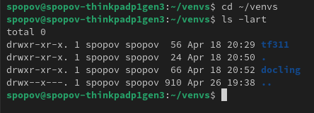

Each folder (tf311, docling, etc.) is one separate environment.

Like for TF -> TensorFlow

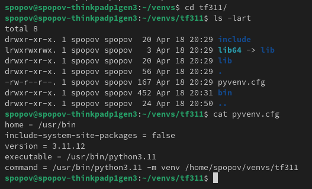

=== Activating an Environment

To “enter” a venv, you source its activation script. That makes its Python and pip become the defaults in your shell:

```
# Bash / Zsh
source ~/venvs/tf311/bin/activate

# Fish shell
source ~/venvs/tf311/bin/activate.fish

# C shell
source ~/venvs/tf311/bin/activate.csh
```

Once activated, your prompt usually gets a prefix like (tf311), and:

* python → the tf311 environment’s interpreter

* pip → installs into tf311 only

=== Deactivating

To go back to your system Python (or whatever you had before):

```
deactivate
```

That un-sets the venv’s paths and restores your prompt.

=== Creating a New Virtual Env

You can make as many as you need. Pick a name that indicates its purpose:

```
# From anywhere, create a new env named “myproject”
python3 -m venv ~/venvs/myproject
```


* python3 -m venv uses the system (or python3) interpreter as the base.

* It makes a folder ~/venvs/myproject with its own bin/, lib/, etc.


=== Managing Packages Inside a Venv

With the venv activated, use pip normally:

```
pip install numpy pandas        # add packages
pip list                        # show installed packages
pip freeze > requirements.txt   # snapshot versions
pip install -r requirements.txt # install from a snapshot
pip uninstall PACKAGE_NAME      # remove a package
```

All installs stay isolated in that venv’s lib/ folder.


=== Switching Between Envs

Just deactivate one and activate another:

```
# Suppose you’re in (docling)
deactivate

# Now switch to tf311
source ~/venvs/tf311/bin/activate
```

Your prompt will change to reflect the active environment.


=== Checking Which Python You’re Using

To be sure, run:

```
which python
# or
python -c "import sys; print(sys.prefix)"
```

Both should point into ~/venvs/<env-name>/… when the venv is active.

=== When & Why to Use Each

* tf311 might be for TensorFlow 3.1.1 work: it keeps those heavy dependencies separate.

* docling maybe holds Lingua/linguistic-analysis libraries for documentation tasks.

* You switch into each only when working on that specific area—so you never install conflicting versions side-by-side.

=== Quick Workflow Example

```
# Start a new feature in “myproject”
python3 -m venv ~/venvs/myproject
source ~/venvs/myproject/bin/activate
pip install flask sqlalchemy
# … develop, test, etc.
pip freeze > requirements.txt
deactivate
```

Bottom line: virtual environments give you clean, predictable Python setups per project—just activate the one you need, install or remove packages inside it, and switch around with `deactivate/source …/bin/activate`.


== Installing InstructLab

REF: https://www.redhat.com/en/blog/how-instructlabs-synthetic-data-generation-enhances-llms
InstructLab Ref: https://github.com/instructlab/instructlab?tab=readme-ov-file#install-using-pytorch-without-cuda-bindings-and-no-gpu-acceleration

1. Set Up Your Development Environment

It’s a good idea to work in a virtual environment. This ensures that the dependencies for InstructLab won’t conflict with other projects you may have:

Create a Virtual Environment:

```
python3 -m venv venv
```

Activate the Virtual Environment:

On Linux/macOS:

```
source venv/bin/activate
```

2. Clone the InstructLab Repository

Cloning the entire repository is advisable because you’ll have access to all of the code, configurations, and documentation. Run:

```
git clone https://github.com/instructlab/instructlab.git
```

Then change into the repository directory:

```
cd instructlab
```

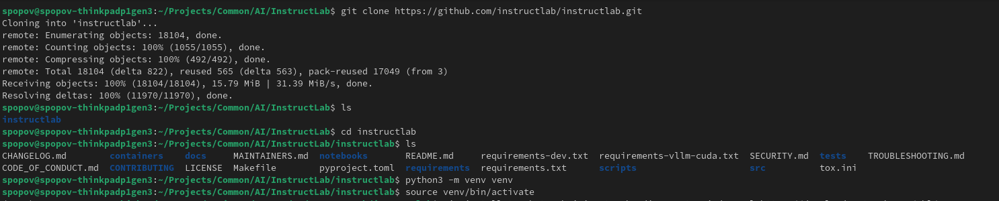


Running ilab

```
spopov@spopov-thinkpadp1gen3:~/Projects/Common/AI/InstructLab/instructlab$ source venv/bin/activate
(venv) spopov@spopov-thinkpadp1gen3:~/Projects/Common/AI/InstructLab/instructlab$ ilab
Usage: ilab [OPTIONS] COMMAND [ARGS]...

  NOTE: ilab no longer supports Python 3.9 or Python 3.12 as of version 0.18.
  If you are using either of these Python versions, there is no upgrade path
  from ilab 0.17 to newer ilab versions. Please switch to Python 3.10 or 3.11
  to use the latest ilab. ilab 0.17 will receive no bug fixes or additional
  features. You can check which Python version you are using by running
  `python --version
```

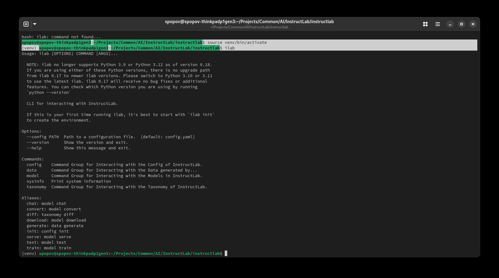


3. Install the Required Dependencies


InstructLab’s documentation specifies an installation using PyTorch without CUDA bindings (for CPU-only mode). Check the InstructLab README for any additional details, but in general you should:

*Install PyTorch (CPU-only):*

```
pip install torch torchvision torchaudio --extra-index-url https://download.pytorch.org/whl/cpu
```


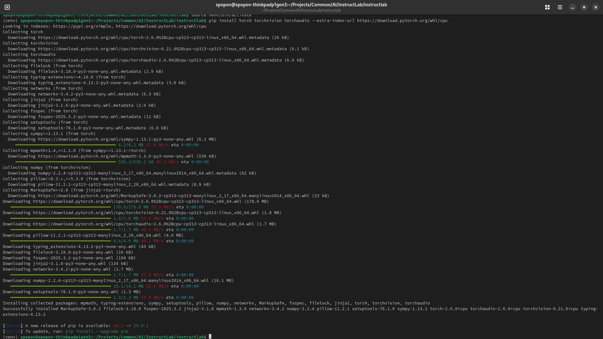

upgrade psp to newest version

```
pip install --upgrade pip
```

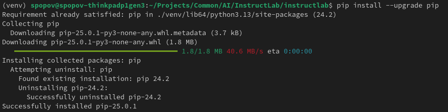


```
python<version> -m venv --upgrade-deps venv
source venv/bin/activate
pip install instructlab
```

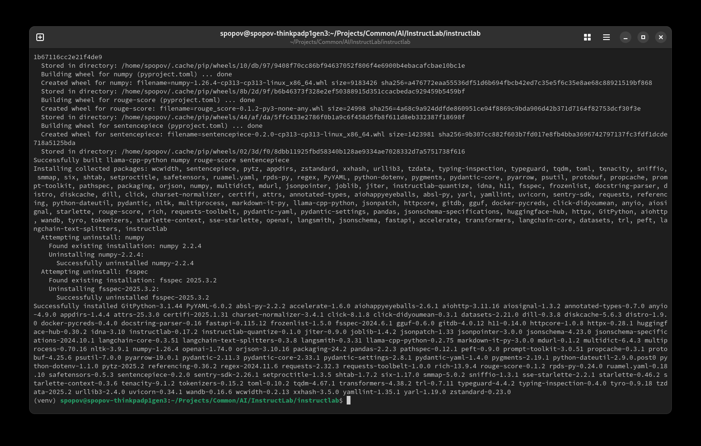

From your venv environment, verify ilab is installed correctly, by running the ilab command.

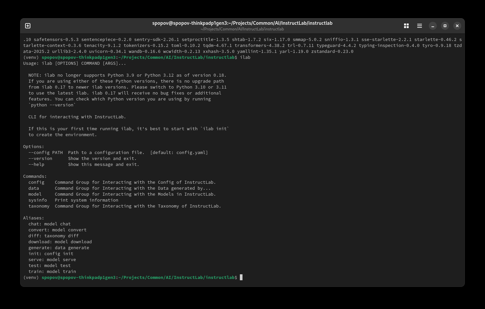


Check your InstructLab version:

```
ilab --version
```


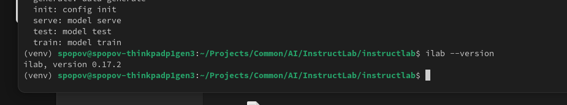


Now, initialize InstructLab configuration:

```
ilab config init
```


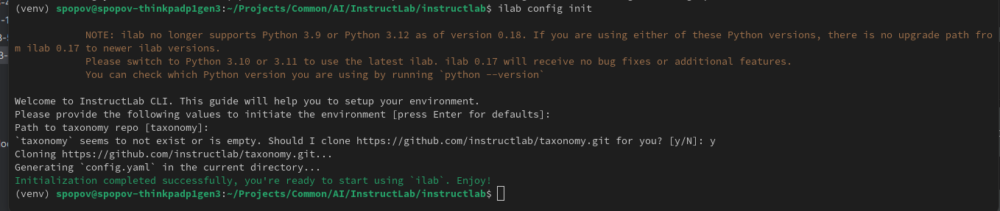

*Optional*

Install Other Python Dependencies:

The repository likely contains a requirements.txt file. Install these dependencies with:


```
pip install -r requirements.txt
```

This command will install all the libraries needed by InstructLab as defined by its maintainers.

Official install from InstructLab Gitlab


== Install Node and NPM

https://nodejs.org/en/download

```
# Download and install nvm:
curl -o- https://raw.githubusercontent.com/nvm-sh/nvm/v0.40.3/install.sh | bash

# in lieu of restarting the shell
\. "$HOME/.nvm/nvm.sh"

# Download and install Node.js:
nvm install 22

# Verify the Node.js version:
node -v # Should print "v22.15.0".
nvm current # Should print "v22.15.0".

# Verify npm version:
npm -v # Should print "10.9.2".
```

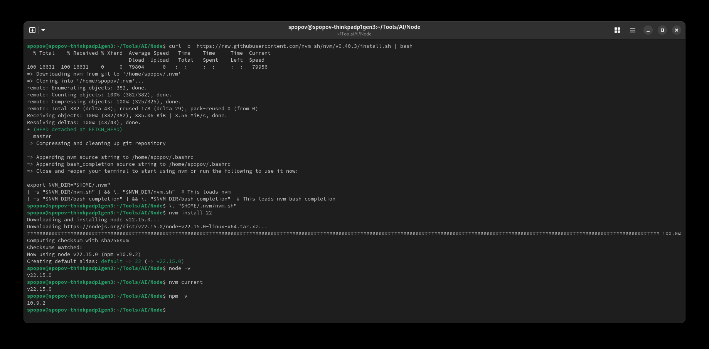

== Install Podman AI Lab extension

Go to Podman extensions and install required for AI Lab

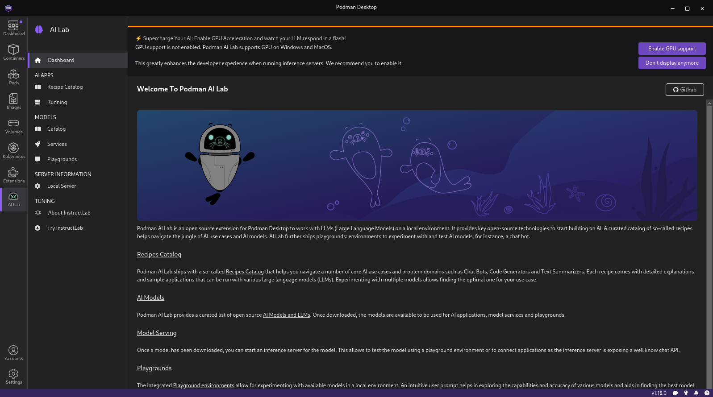

== Troubleshooting InstructLab install

1. C compiler is missing

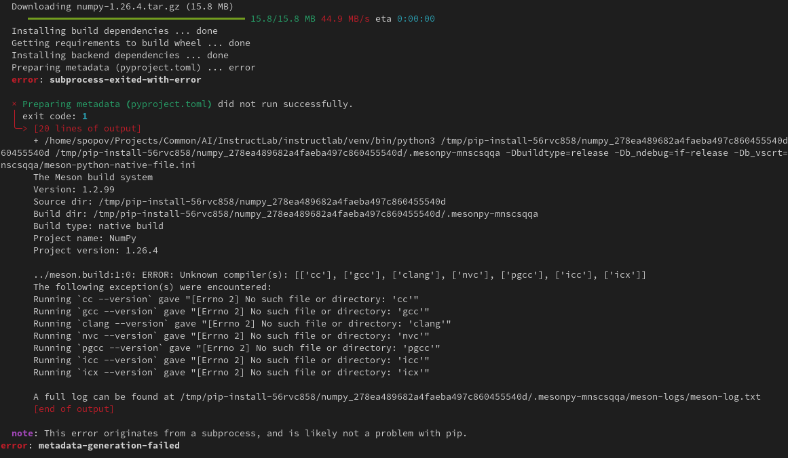

The error you're encountering is coming from the build process of the NumPy package (a dependency) which is being compiled during the installation. The error message indicates that it cannot find any suitable C compilers (like cc, gcc, or clang) on your system. Since NumPy (and some other libraries) often require a C compiler to build from source, you'll need to install one.

This command will install GCC, make, and other necessary tools. You can install GCC specifically with:

```
sudo dnf install gcc gcc-c++ make
```

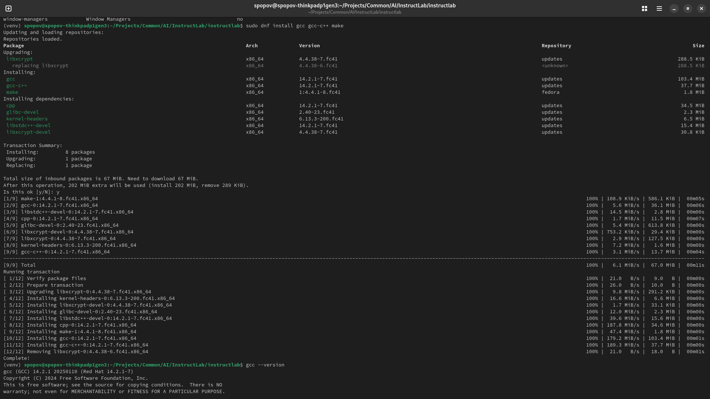

```
(venv) spopov@spopov-thinkpadp1gen3:~/Projects/Common/AI/InstructLab/instructlab$ gcc --version
gcc (GCC) 14.2.1 20250110 (Red Hat 14.2.1-7)
Copyright (C) 2024 Free Software Foundation, Inc.
This is free software; see the source for copying conditions.  There is NO
warranty; not even for MERCHANTABILITY or FITNESS FOR A PARTICULAR PURPOSE.
```


2. Python development package is missing

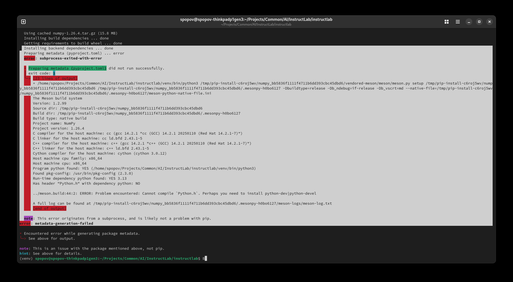

The error message indicates that the build process cannot find the header file "Python.h." This header is part of the Python development package, which is necessary when compiling C extensions for Python. On Fedora, you’ll need to install the appropriate development package.

Run the following command to install the Python 3 development libraries:

```
sudo dnf install python3-devel
```

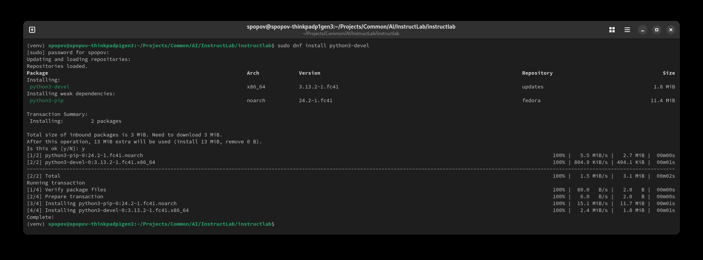


3, Rust Cargo missing

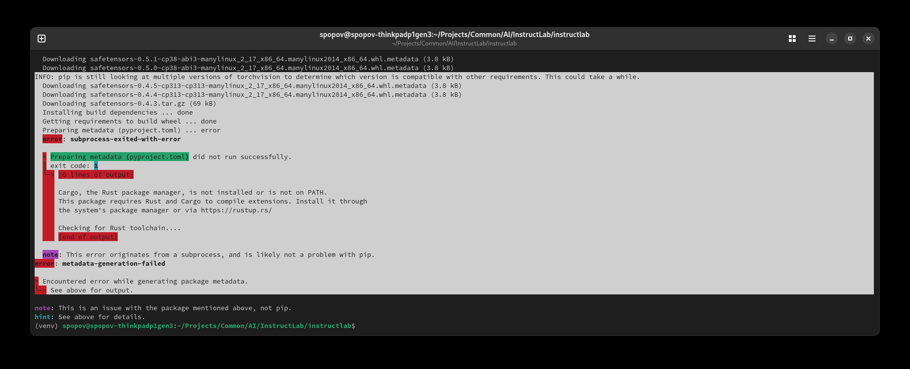

The error indicates that the package you're trying to install requires the Rust toolchain—including Cargo, the Rust package manager—to build some Rust extensions. You’ll need to install Rust on your system.

Installing Rust on Fedora
You have two common options to install Rust:

Option 1: Using dnf

On Fedora, you can install Rust and Cargo using the package manager by running:

```
sudo dnf install rust cargo
```

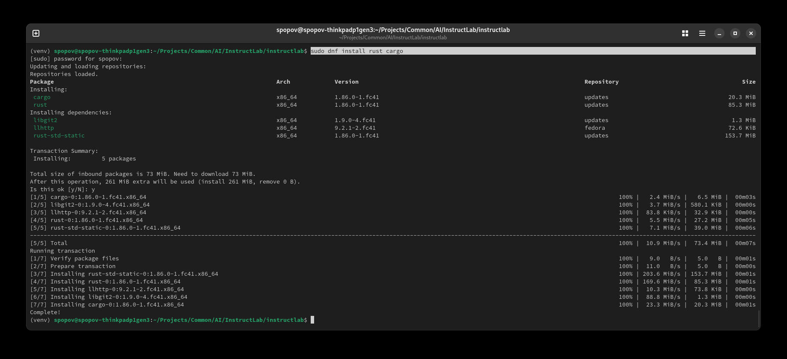


4. Missing Cmake

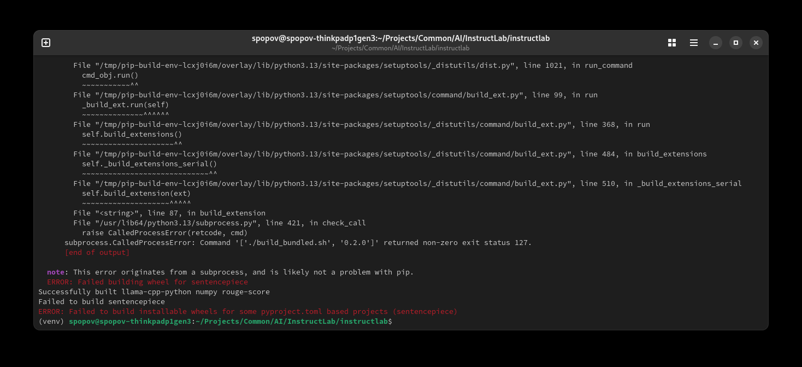


Sentencepiece’s build process often depends on CMake. On Fedora, you can install CMake by running:


```
sudo dnf install cmake
```

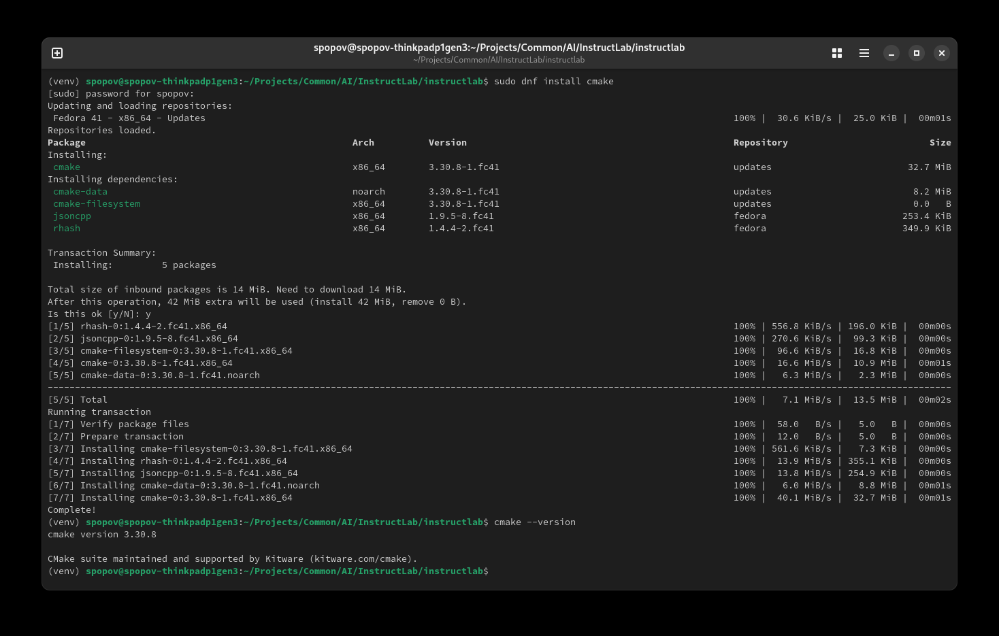

