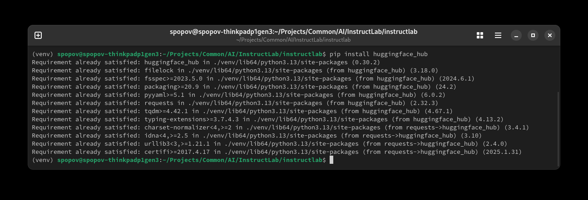
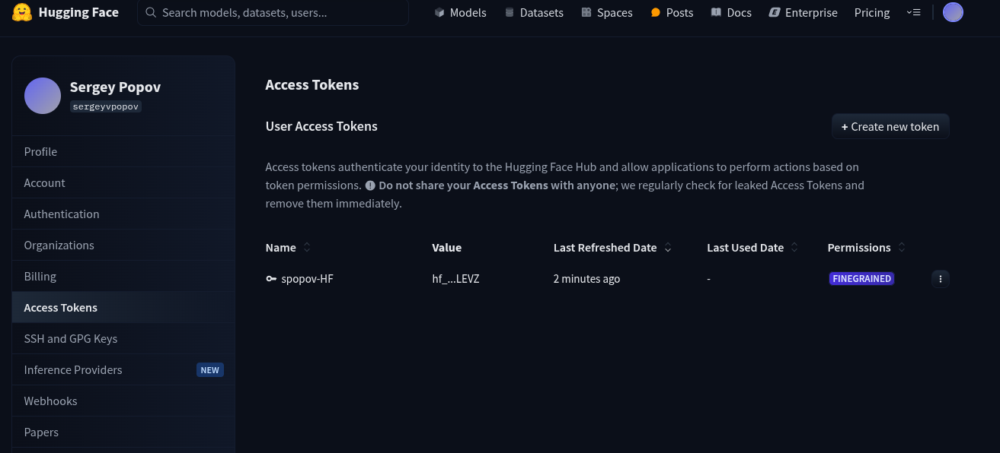
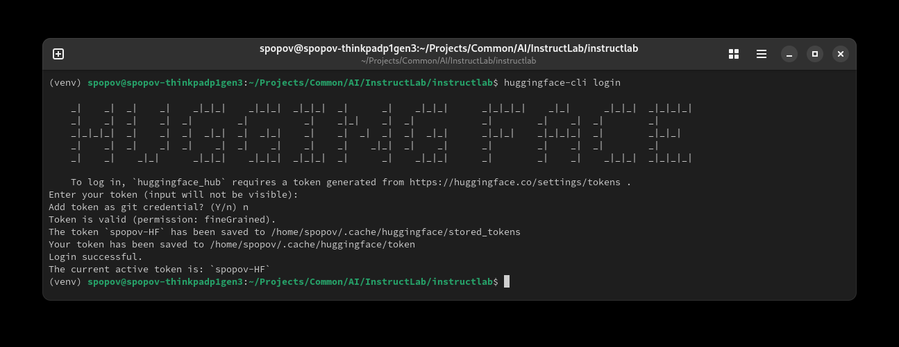
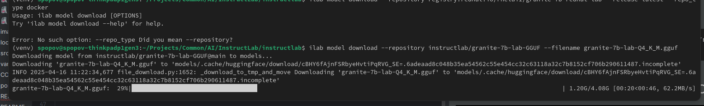
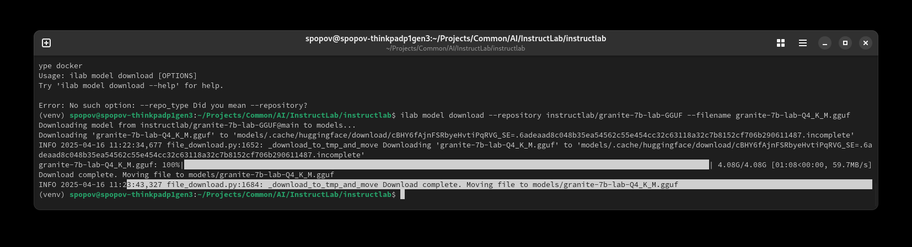
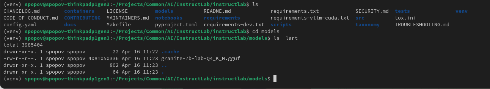
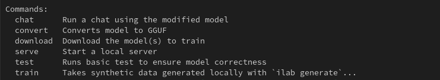
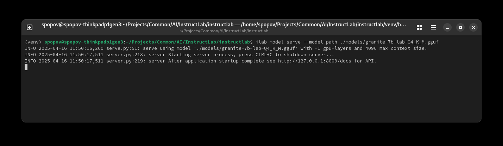
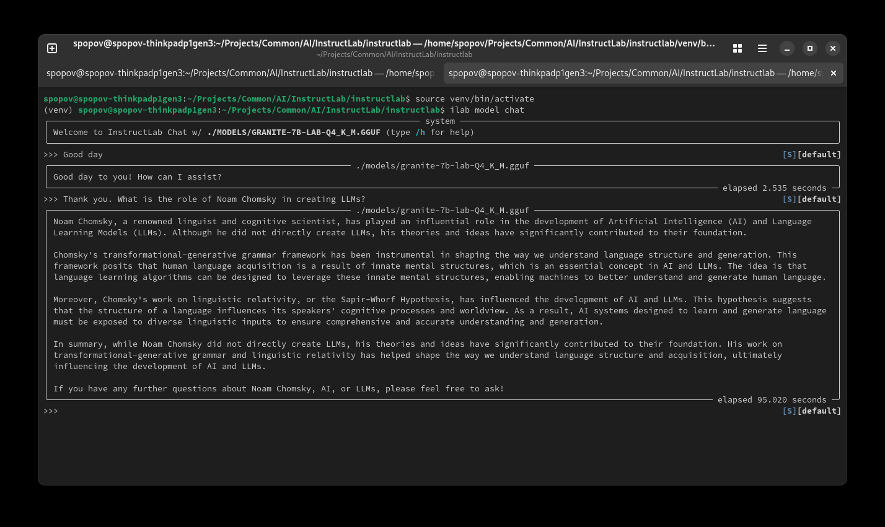
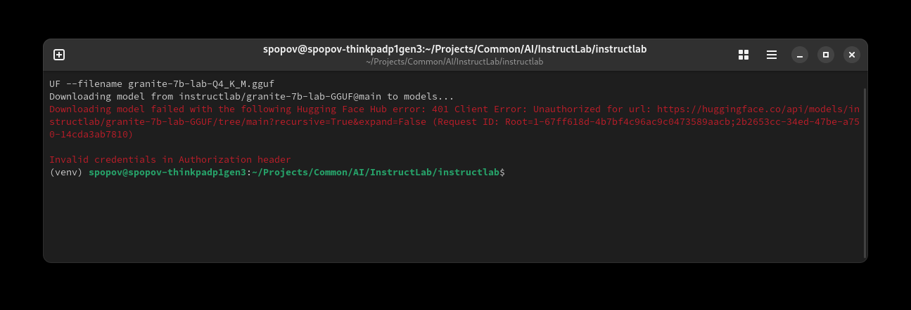

ifdef::imagesdir[:imagesdir: content/110_installation]

= Setting up models

REF: https://www.redhat.com/en/blog/instructlab-tutorial-installing-and-fine-tuning-your-first-ai-model-part-1

Install the HF CLI (if not installed):

```
pip install huggingface_hub
```




generate and download Hf token, keep it safe




Login to HF using token:

You’ll be prompted to enter your access token, which you can generate from Hugging Face settings. Once logged in, the CLI stores the token in your home directory (typically in ~/.huggingface/hub), and many tools will automatically pick it up.

```
huggingface-cli login
```





If you prefer to provide the token as an environment variable, you can set HF_API_TOKEN (or sometimes HF_TOKEN) before running your command. For example:


```
export HF_TOKEN="your_huggingface_access_token"

```


Download the Granite 7B-lab starter model:

```
ilab model download --repository instructlab/granite-7b-lab-GGUF --filename granite-7b-lab-Q4_K_M.gguf
```



Completed as:




Checking model list




Now we have list of commands




== Serving the model

At this point, you are able to chat with your model. You will need two different sessions, one for serving the model and the other for chatting with the model.

Begin by starting the model server:

```
(venv) spopov@spopov-thinkpadp1gen3:~/Projects/Common/AI/InstructLab/instructlab$ ls ./models/ -lart
total 3985404
drwxr-xr-x. 1 spopov spopov         22 Apr 16 11:22 .cache
-rw-r--r--. 1 spopov spopov 4081050336 Apr 16 11:23 granite-7b-lab-Q4_K_M.gguf
drwxr-xr-x. 1 spopov spopov        802 Apr 16 11:23 ..
drwxr-xr-x. 1 spopov spopov         64 Apr 16 11:23 .
(venv) spopov@spopov-thinkpadp1gen3:~/Projects/Common/AI/InstructLab/instructlab$ ilab model serve --model-path ./models/granite-7b-lab-Q4_K_M.gguf
```




Server started ! We can communicate with it now

Now start a new session in new terminal window

If you are using upstream InstructLab, start venv:

```
source venv/bin/activate
ilab model chat
```




== Troubleshutting model installation




This error indicates that your request to download the model is unauthorized because the Hugging Face Hub is expecting valid credentials. In most cases, you’ll need to provide your Hugging Face access token so that the system can authenticate you.

