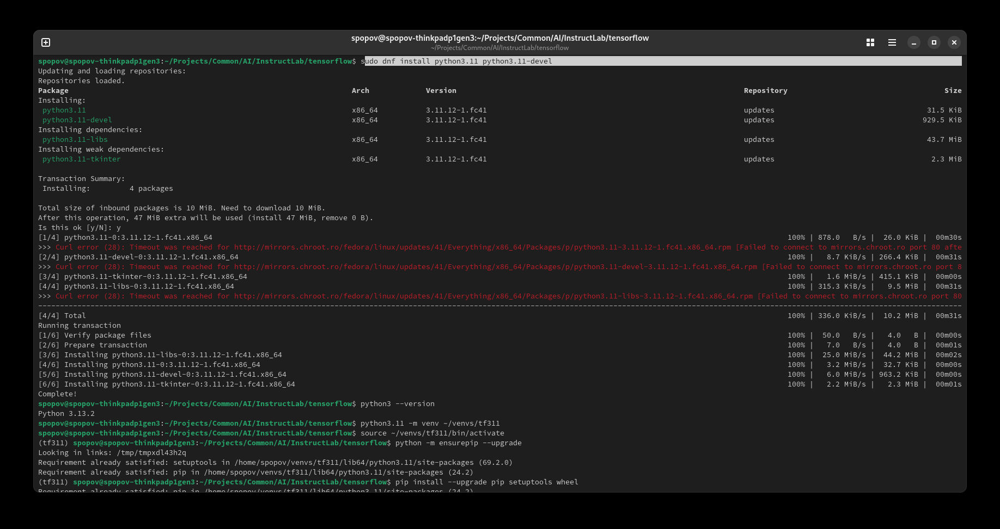
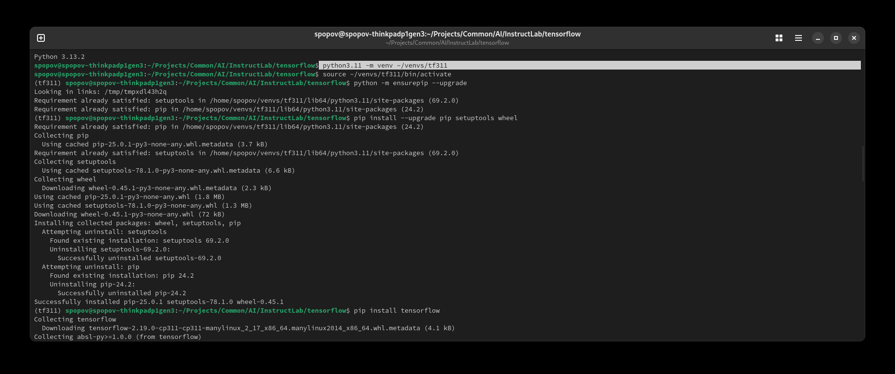
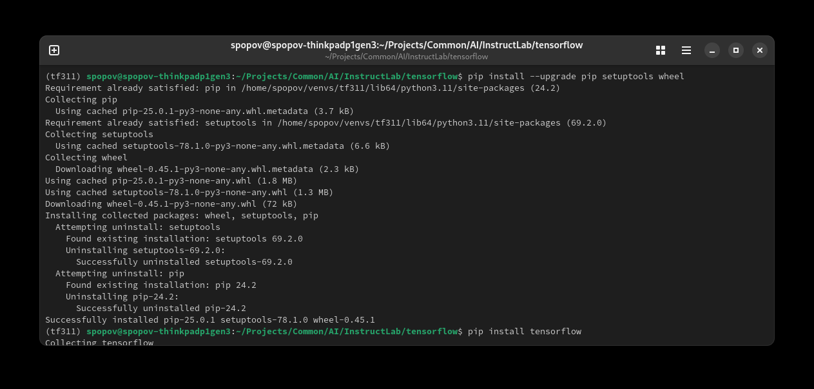
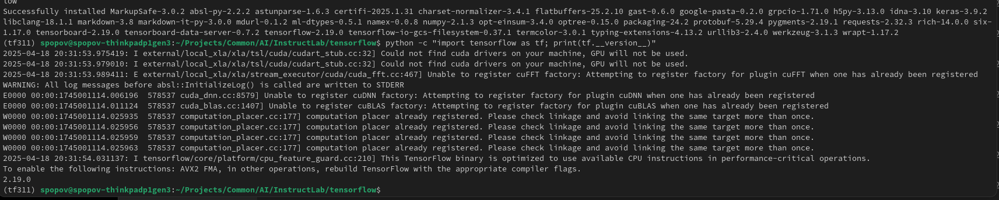

ifdef::imagesdir[:imagesdir: content/110_installation]

= Installing tensorflow

On Fedora, the python3.X-venv package name only exists on Debian/Ubuntu—it doesn’t exist in Fedora’s repos. The good news is that the venv module is built right into the Fedora‐packaged interpreter, so you only need:

----
sudo dnf install python3.11 python3.11-devel
----

----
 python3.11 -m venv ~/venvs/tf311
----

Activate the venv

----
source ~/venvs/tf311/bin/activate
----

Bootstrap pip if needed
If you see an error about missing pip, run:

----
python -m ensurepip --upgrade
----

Upgrade installer tooling

----
pip install --upgrade pip setuptools wheel
----

Install TensorFlow

For the full package (CPU + GPU support):

----
pip install tensorflow
----

Verify the install

----
python -c "import tensorflow as tf; print(tf.__version__)"
----

(Optional) Making Python 3.11 your default python3

If you really want python3 to point at Python 3.11, you can use Fedora’s alternatives system:

----
sudo alternatives --install /usr/bin/python3 python3 /usr/bin/python3.11 2
----

Then choose which version is the default:

----
sudo alternatives --config python3
----
—but be cautious, as changing the system python3 can affect other tools.

