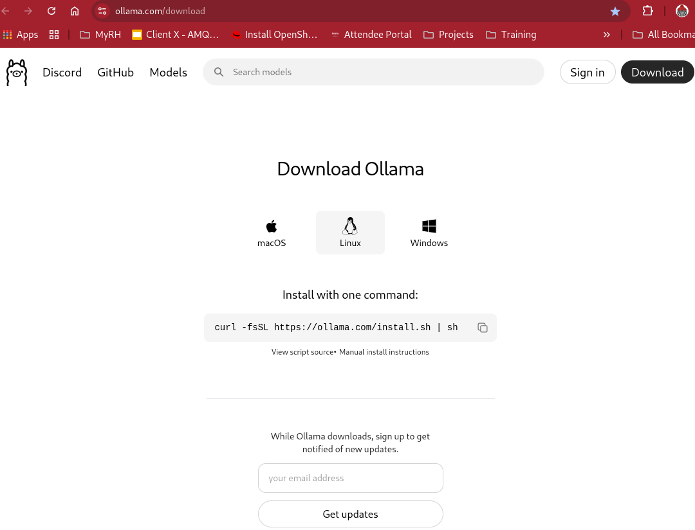
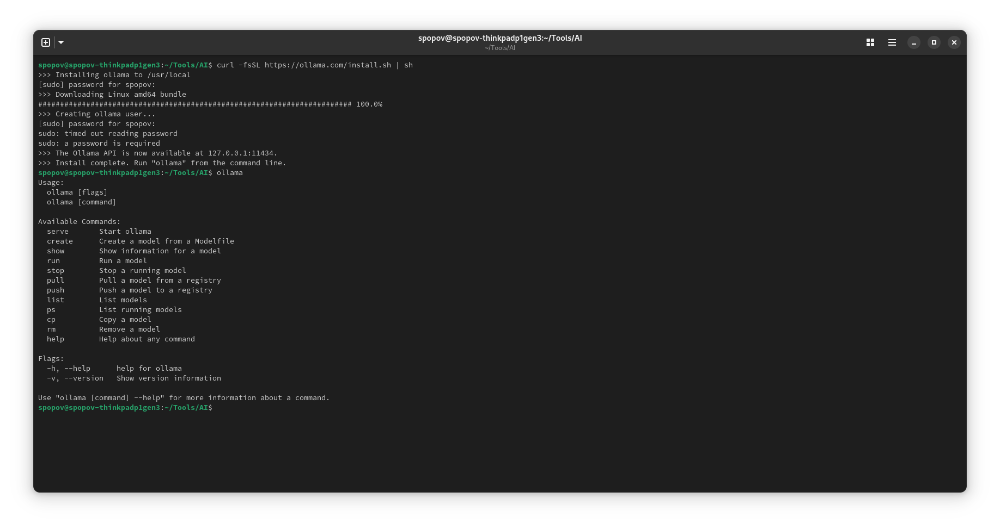
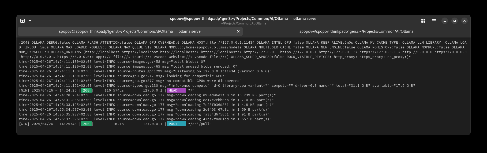
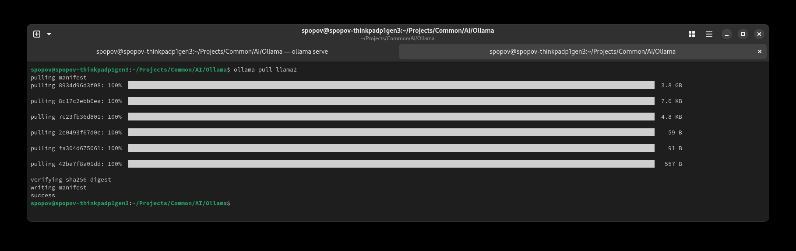
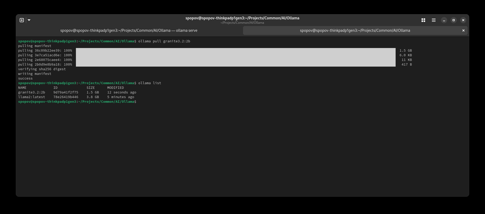

ifdef::imagesdir[:imagesdir: content/110_installation]

= Installing Ollama

Install with one command:

----
curl -fsSL https://ollama.com/install.sh | sh
----

Pull Ollama Images using:

----
ollama pull llama2
----

----
ollama pull granite3.2:2b
----

